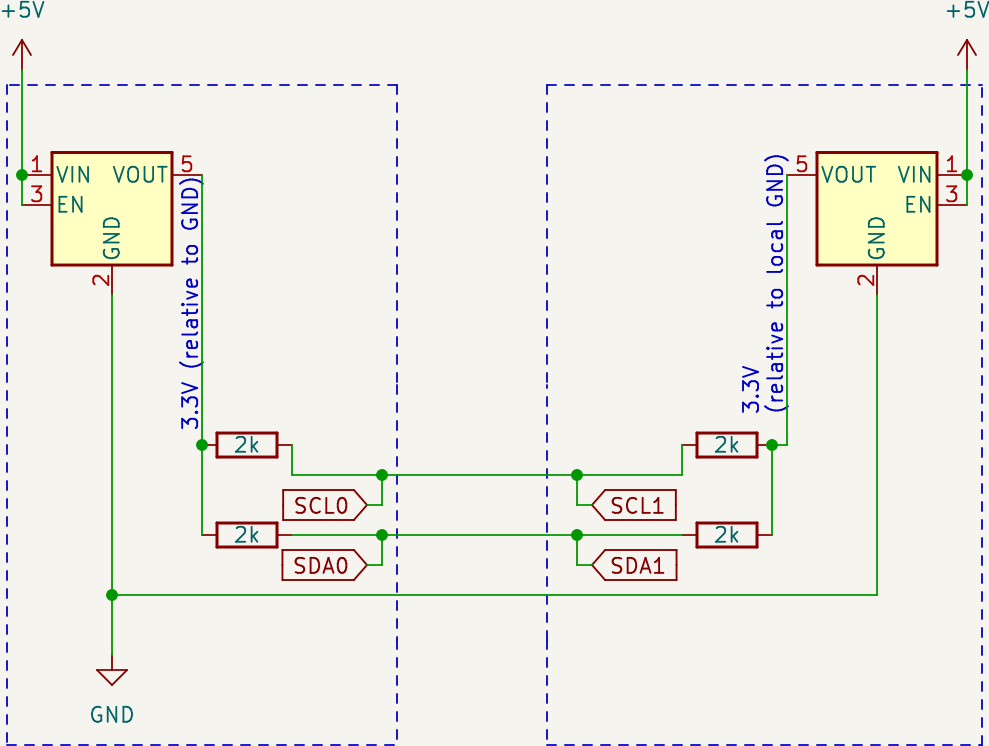

# RP2040 I2C Oddity tester

## Objective

Demonstrate a simple I2C controller-peripheral pair using two board.

## Wiring

- Use GPIO4 and GPIO5 as respectively I2C0 SDA & I2C0 SCL.
- Use 2k pull-ups on each side.

